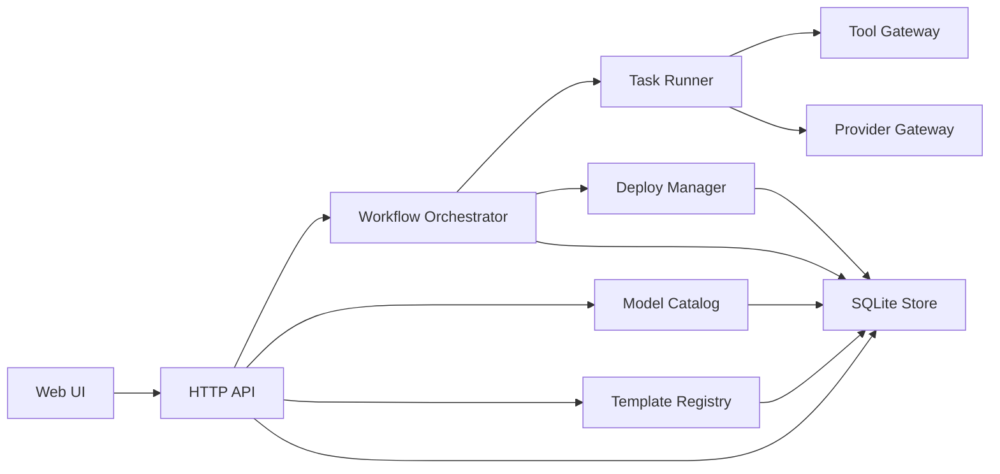

# 系统架构

## 总体架构

## 核心模块

### API 层

- 提供前端界面所需的 REST 接口
- 提供运行状态流式事件接口
- 提供健康检查与部署状态查询

### Workflow Orchestrator

- 管理需求补充、步骤切换、暂停、恢复、终止
- 控制写代码、改代码、跑测试、部署、修复等闭环阶段
- 对相同任务做幂等去重，避免重复跑相同步骤

### Provider Gateway

- 统一不同模型平台的调用抽象
- 维护模型元数据、官网链接、平台归属、排序权重和可用性
- 允许用户按偏好排序、过滤和启用模型

### Template Registry

- 管理内置预设模板
- 保存任务模板、工作流模板和工具启用模板

### Tool Gateway

- 抽象工作区读写、命令执行、测试执行、部署操作
- 所有工具可在工作流中单独启用、禁用或替换

### Deploy Manager

- 提供本机打包、远程上传、远程发布和回滚点记录
- 只清理应用拥有的目录和服务，不触碰系统关键配置
- 通过幂等脚本保证二次部署稳定

## 资源约束策略

- Go 后端单进程常驻
- SQLite 本地嵌入式存储
- SSE 代替 WebSocket，降低复杂度
- 前端仅在开发期依赖 Node，生产期由 Go 静态托管
- 任务调度默认串行，必要时小并发

## 安全与边界

- 不读取或展示敏感凭据内容
- 部署脚本只操作应用前缀目录
- 远程部署默认不执行危险系统管理命令
- SSH 闪退问题通过 `nohup`、日志重定向和 systemd 托管缓解
