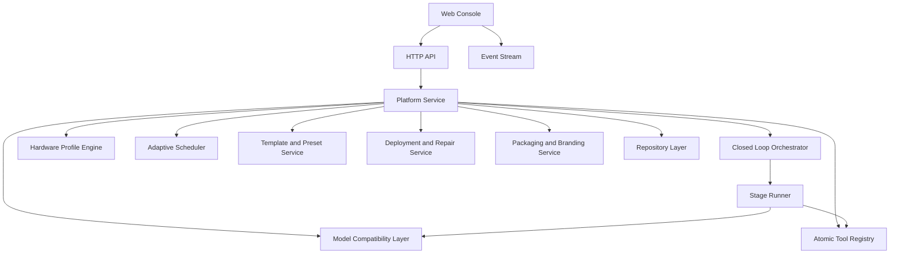

# AI 自动化中枢设计说明

Feature Name: autocode-platform
Updated: 2026-04-21

## Description

系统采用 `Go + 内嵌静态 Web 控制台` 架构。Go 单体负责 API、编排、调度、模型治理、工具治理、部署执行、事件流和静态文件托管；前端控制台由 `internal/httpapi/web/index.html`、`internal/httpapi/web/app.js` 和 `internal/httpapi/web/app.css` 组成，负责提供中文化、产品化的任务编排与治理界面。平台以“运行单”为主线，以统一闭环状态机为骨架，在低资源 VPS 上优先保证核心能力稳定，在更高规格机器上自动放大执行能力。

## Design Principles

1. 自用优先。先满足单人长期高频使用，再考虑轻量产品化扩展。
2. 一次到位。核心骨架按终局架构设计，不做临时拼接式过渡层。
3. 轻量优先。默认适配 1C1G VPS，任何重能力都必须可关闭、可降级、可外部托管。
4. 统一抽象。模型、工具、阶段和交付能力都通过统一抽象接入，避免分裂成多套流程。
5. 插件化加载。非核心能力按需启用，避免默认常驻。
6. 控制台优先。常见治理动作优先在 Web 控制台完成，尽量减少 SSH 依赖。

## Target Architecture

## Runtime Topology

### Backend

- `cmd/server/main.go`: 进程入口与服务启动
- `internal/httpapi`: HTTP API、事件流和静态资源托管
- `internal/service`: 平台核心服务、编排、系统画像、目录治理和部署逻辑
- `internal/store`: 运行时数据存储与仓储实现

### Frontend

- `internal/httpapi/web/index.html`: 控制台结构与挂载点
- `internal/httpapi/web/app.js`: 页面状态、数据请求、标签映射和交互逻辑
- `internal/httpapi/web/app.css`: 日夜主题、布局、卡片层级和产品化样式

## Core Modules

### Closed Loop Orchestrator

统一管理运行单生命周期。编排器以固定闭环骨架驱动执行，但允许按任务类型裁剪步骤。建议采用以下 12 步骨架：

1. 任务识别
2. 上下文汇总
3. 方案规划
4. 资源收束
5. 模型选择
6. 工具装配
7. 执行生成
8. 结果整理
9. 验证检查
10. 部署交付
11. 修复回路
12. 总结沉淀

每一步都产出结构化摘要，供后续步骤和控制台展示复用。

### Hardware Profile Engine

负责检测 CPU、内存、磁盘和其他可观测约束，生成运行档位，例如 `home-lite`、`balanced-hybrid`、`adaptive-performance`。档位不直接暴露给最终用户，而是转译为中文策略说明。

该引擎需要输出：

- 最大建议并发度
- 本地模型是否允许启用
- 默认测试深度
- 是否建议外部托管重能力
- 缓存与日志保留策略

### Adaptive Scheduler

调度器同时结合运行单优先级、阶段负载、硬件档位和当前资源预算来选择下一步执行内容。轻量环境默认采用串行优先，较高档位可放宽并发。

调度器职责包括：

- 去重冲突阻断
- 负载型阶段延后
- 高风险阶段前置确认
- 自动修复重试计数
- 资源回收后的队列唤醒

### Model Compatibility Layer

对不同模型平台做统一封装，屏蔽接入方式、流式输出、参数结构和能力差异。该层需要区分两类治理域：

- API 模型域：远程平台、供应商 API、托管推理服务
- 本地模型域：按需启用、本地推理、资源敏感能力

统一抽象至少包含：

- 模型身份与来源
- 上下文窗口与输出模式
- 工具调用能力
- 成本与资源估计
- 回退模型与失败重试策略

### Atomic Tool Registry

把平台非模型能力统一整理为原子能力注册表，避免多个入口重复实现相同事情。每个原子能力都应记录：

- 能力名称
- 所属类别
- 适用阶段
- 负载等级
- 首选实现与候补实现
- 依赖条件
- 是否按需启用

原子能力可以被完整运行单调用，也可以由用户在控制台中独立调用。

### Template and Preset Service

统一维护任务模板、阶段模板、工具组合和运行策略预设。模板的作用不是复制流程，而是给统一闭环骨架提供不同默认参数。

### Deployment and Repair Service

负责应用级幂等部署、部署日志摘要、失败收敛和自动修复回路。部署设计遵循以下限制：

- 不执行系统级破坏性清理
- 优先使用可重复执行的发布目录切换
- 对必须人工确认的动作给出明确提示
- 失败后保留足够证据供修复阶段消费

### Packaging and Branding Service

负责品牌资源、配置模板、可选插件和交付包版本边界。目标不是马上做重产品化，而是预留轻量白标和离线分发所需的清晰分层。

## Data Models

### Run

- `id`: 运行单 ID
- `title`: 任务标题
- `goal`: 需求内容
- `intent`: 任务意图
- `deliveryMode`: 交付方式
- `status`: `queued | running | paused | failed | completed`
- `dedupKey`: 去重键
- `policyDecisions`: 运行策略决策集合
- `stages`: 阶段列表
- `templateId`: 模板 ID
- `autoRepairEnabled`: 是否启用自动修复
- `remoteDeployEnabled`: 是否启用远程部署

### Stage

- `id`: 阶段 ID
- `kind`: 闭环阶段类型
- `status`: `pending | running | paused | failed | completed | skipped`
- `tools`: 工具能力配置列表
- `model`: 当前阶段使用的模型信息
- `summary`: 阶段摘要
- `evidence`: 验证或失败证据集合

### SystemProfile

- `tier`: 运行档位
- `cpuCores`: CPU 核数
- `memoryMB`: 内存容量
- `storageClass`: 存储级别
- `recommendedConcurrency`: 建议并发度
- `localModelAllowed`: 是否允许启用本地模型
- `strategySummary`: 中文策略摘要

### ModelProfile

- `id`: 模型标识
- `provider`: 平台标识
- `name`: 模型显示名
- `website`: 官网链接
- `region`: `domestic | global`
- `accessMode`: `api | local | hosted`
- `capabilities`: 能力标签集合
- `alignmentScore`: 趋向分数，值越低越优先
- `filterScore`: 过滤分数，值越低越优先
- `reviewScore`: 审查分数，值越低越优先

### AtomicTool

- `id`: 原子能力标识
- `name`: 展示名称
- `category`: 能力类别
- `stageKinds`: 适用阶段集合
- `loadTier`: 负载等级
- `preferredProvider`: 首选实现
- `fallbackProviders`: 候补实现集合
- `activationMode`: `builtin | optional | external`

## Interfaces

### HTTP API

- 运行单创建、查询、暂停、恢复、补充需求
- 模型目录与模型治理接口
- 模板与预设查询接口
- 系统画像与运行策略查询接口
- 工具目录与能力启停接口
- 部署、修复和交付动作接口

### Event Stream

提供运行单状态、阶段更新、策略决策、建议消息和日志摘要推送。事件应优先传输摘要化信息，避免把底层内部枚举直接暴露到控制台。

## Correctness Properties

1. 相同去重键在同一时刻最多只能存在一个 `queued` 或 `running` 的运行单。
2. 运行单处于 `paused` 状态时，调度器不得推进后续阶段。
3. 系统画像变化后，新的策略决策必须作用于后续待执行阶段。
4. 本地模型域和 API 模型域必须分开治理，不得混淆启停状态。
5. 非启用插件不得形成默认常驻负担。
6. 自动修复达到阈值后，运行单必须转入人工确认状态。
7. 部署服务只允许清理应用拥有的目标目录。

## Error Handling

- 模型未就绪：返回 `400` 并给出缺失配置提示
- 去重冲突：返回 `409` 并附带已有运行单 ID
- 阶段非法流转：返回 `422`
- 能力未启用：返回明确的依赖缺失或启用说明
- 测试失败：记录失败摘要并允许修复阶段消费
- 部署失败：记录步骤和日志片段，不做系统级回滚破坏

## Test Strategy

- 后端单元测试：系统画像、去重键、状态机、策略决策、能力收束
- 后端集成测试：HTTP API、事件流、调度行为、部署动作边界
- 前端脚本校验：`node --check internal/httpapi/web/app.js`
- 前端交互测试：任务创建、详情展示、模型治理、策略提示
- Go 全量测试：`go test ./...`

## References

[^1]: (.monkeycode/specs/autocode-platform/requirements.md) - 需求文档
